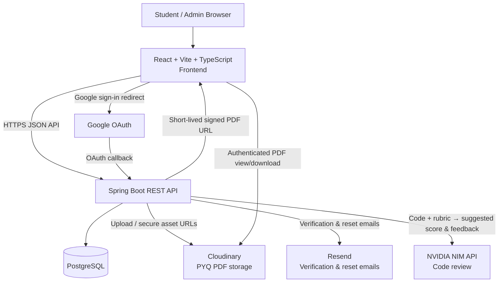
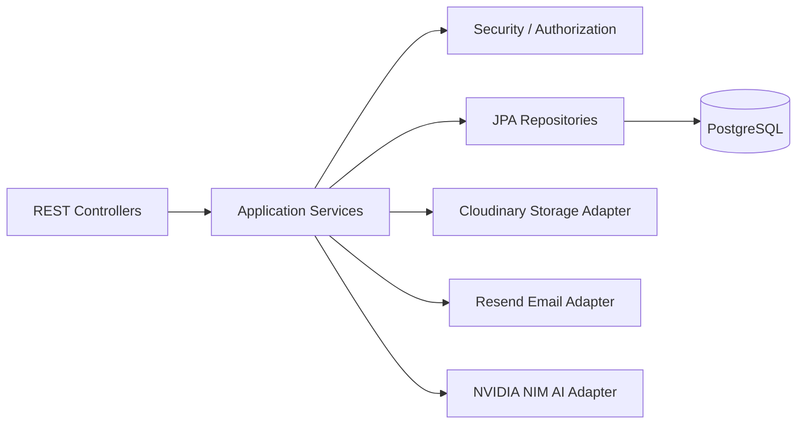
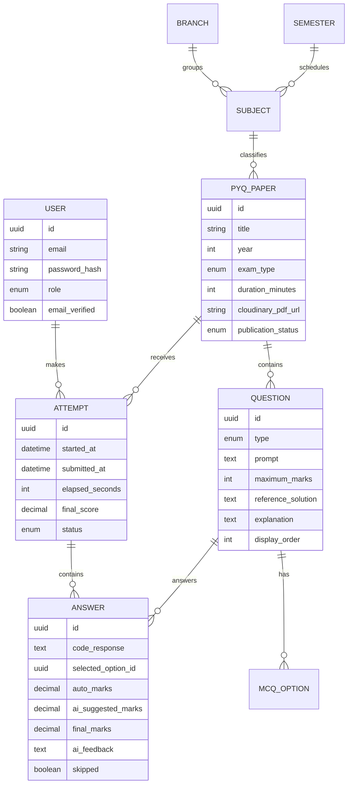

# System Architecture — PYQ Practice Platform

## Architecture overview

## Frontend architecture

Use React as a single-page application, organized by feature rather than by page-only folders.

- **Authentication:** registration, email verification, login, Google sign-in, password reset, token/session handling, protected routes.
- **Catalog:** searchable/filterable PYQ list using branch, semester, subject, exam type, and year.
- **Paper:** paper details and Paper Mode; renders the Cloudinary-hosted original PDF.
- **Practice:** question navigation, answer autosave, MCQ selection, code-answer editor, practice timer, skip option, final submission, and solution review.
- **Dashboard:** attempt history, score trends, and MCQ accuracy summaries.
- **Admin:** academic catalog management, PDF upload, question authoring, answer/solution entry, duration configuration, and publish/unpublish controls.
- **Shared layer:** typed API client, authentication state, reusable form components, error handling, loading states, and route guards.

The browser never receives database credentials, Cloudinary secrets, Resend keys, NVIDIA keys, or privileged admin-only data.

## Backend architecture

Structure Spring Boot as a modular monolith. This is the right v1 choice: easier to develop, deploy, test, and maintain than microservices, while retaining clean module boundaries.

Core modules:

- **Auth module:** local credentials, Google OAuth identities, verified-account workflow, password reset, role assignment, and session/token security.
- **Catalog module:** branches, semesters, subjects, exam types, PYQ discovery, filtering, and published-paper visibility.
- **Paper authoring module:** admin-only paper metadata, Cloudinary PDF upload, question management, answer keys, code reference solutions, and publication state.
- **Attempt module:** start/resume attempt, save answers, timer timestamps, MCQ marking, submission locking, and final-score calculation.
- **AI review module:** builds a safe review prompt from the code question, student response, expected behavior, and rubric; calls NVIDIA NIM; validates its structured suggested-mark response; stores feedback.
- **Analytics module:** returns only the signed-in student’s attempt and accuracy aggregates.
- **Notification module:** sends verification and password-reset emails through Resend.

## Data architecture

## Key request flows

### Paper Mode

1. Student signs in and filters the catalog.
2. React requests published papers from Spring Boot.
3. Spring Boot returns paper metadata and an authorized PDF URL.
4. React displays the original Cloudinary PDF and download option.

### Test Mode

1. Student starts a test; backend creates a resumable attempt.
2. React periodically saves answers and elapsed practice time.
3. MCQs are scored automatically during final submission.
4. Code responses are sent to Spring Boot for NVIDIA NIM review.
5. Backend saves AI feedback and suggested marks.
6. Student accepts or adjusts each suggested code mark.
7. Backend locks the attempt, calculates the final score, and unlocks answers/solutions.
8. Dashboard receives updated performance data.

### Admin content flow

1. Admin creates academic metadata if needed.
2. Admin uploads a PDF through the backend to Cloudinary.
3. Admin creates digitized MCQ/code questions, marks, choices, solutions, and duration.
4. Admin publishes the paper.
5. Only published papers appear to students.

## Security and reliability decisions

- Use HTTPS in production, BCrypt/Argon2 password hashing, Spring Security authorization, and secure HTTP-only, `Secure`, `SameSite` cookie sessions. React never stores a JWT in local storage or session storage.
- Require verified email before a student can start tests or access dashboard data.
- Enforce ownership checks: a student can access only their own attempts and answers.
- Enforce `ADMIN` role on all content management endpoints.
- Validate PDF type and size, sanitize input, rate-limit login/reset/AI-review endpoints, and record audit events for admin actions.
- Keep all third-party credentials in deployment environment variables.
- Generate short-lived Cloudinary signed URLs only after Spring Boot confirms that the signed-in, verified user may access the paper. This permits viewing/downloading while preventing permanent public PDF links.
- If Cloudinary, Resend, or NVIDIA NIM fails, return a clear recoverable error; never lose an in-progress answer. NVIDIA review failure leaves the code response saved and lets the student skip or self-score.

## Deployment topology

- **Frontend:** Vercel or Netlify.
- **Backend:** a free-tier Java/Spring Boot host.
- **Database:** managed PostgreSQL free tier.
- **Files:** Cloudinary.
- **External services:** Google OAuth, Resend, NVIDIA NIM.
- **Local development:** Docker Compose for PostgreSQL and Spring Boot dependencies; React runs separately with a local API base URL.

## Acceptance criteria

- A verified student can browse all published PYQs by the required academic filters.
- A student can read/download the original PDF in Paper Mode.
- A student can complete/resume a timed practice attempt containing MCQs and code questions.
- MCQs are automatically graded; code questions obtain NVIDIA feedback and student-confirmed marks.
- Answers and solutions remain inaccessible until the student submits.
- The dashboard accurately reflects final attempts and progress.
- The sole admin can create, edit, publish, and remove papers/questions without granting student access to admin functions.

## Assumptions

- You upload and digitize all papers in v1; student PDF submissions are excluded.
- Any email address may create an account, but verification is required.
- NVIDIA NIM supplies suggested code marks and feedback only; it is not an online compiler or final authority. Objective code grading is a later feature requiring an isolated execution sandbox and hidden test cases.
- The first implementation step after Plan Mode is creating `PLAN.md`, then scaffolding the React and Spring Boot applications around this architecture.
